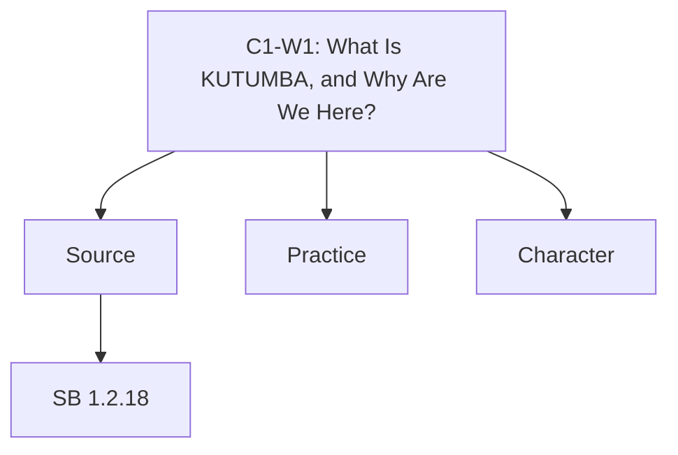

# Concept Map — C1-W1

Render in Markdown preview. Source: [`concept-map.mmd`](concept-map.mmd)

```mermaid
flowchart TB
  A["C1-W1: What Is KUTUMBA, and Why Are We Here?"] --> B[Source]
  A --> C[Practice]
  A --> D[Character]
  B --> E[SB 1.2.18]
```
