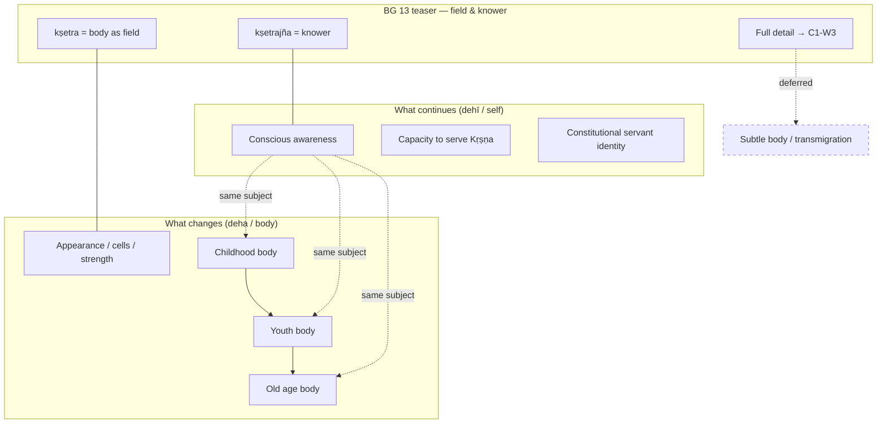

# Concept Map

Rendered viewer for [`concept-map.mmd`](concept-map.mmd). Open this file in Markdown preview to see the diagram.

_Source file: `concept-map.mmd` — edit the `.mmd` file for diagram changes._
