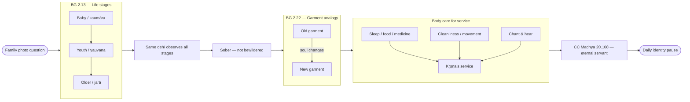

# Process Flow

Rendered viewer for [`process-flow.mmd`](process-flow.mmd). Open this file in Markdown preview to see the diagram.

_Source file: `process-flow.mmd` — edit the `.mmd` file for diagram changes._
