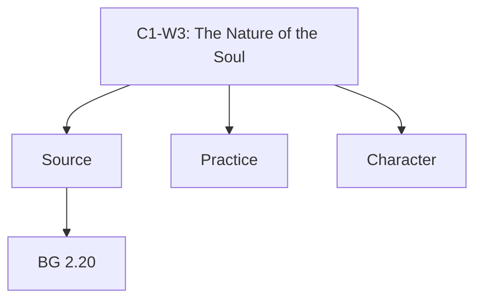

# Process Flow — C1-W3

Render in Markdown preview. Source: [`process-flow.mmd`](process-flow.mmd)

```mermaid
flowchart TB
  A["C1-W3: The Nature of the Soul"] --> B[Source]
  A --> C[Practice]
  A --> D[Character]
  B --> E[BG 2.20]
```
