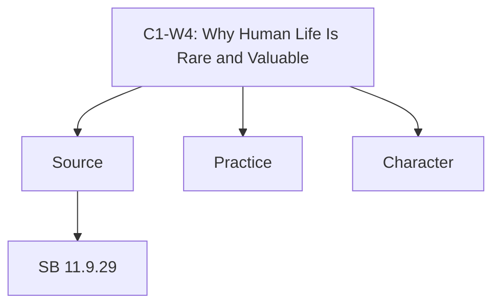

# Concept Map — C1-W4

Render in Markdown preview. Source: [`concept-map.mmd`](concept-map.mmd)

```mermaid
flowchart TB
  A["C1-W4: Why Human Life Is Rare and Valuable"] --> B[Source]
  A --> C[Practice]
  A --> D[Character]
  B --> E[SB 11.9.29]
```
