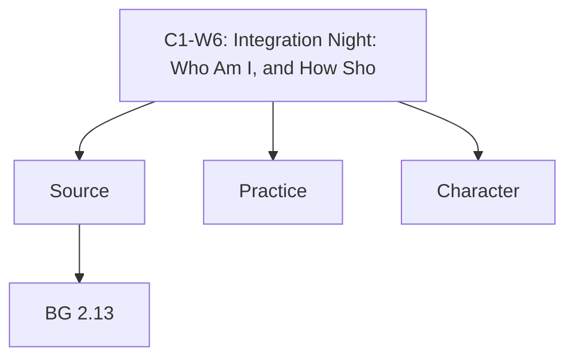

# Concept Map — C1-W6

Render in Markdown preview. Source: [`concept-map.mmd`](concept-map.mmd)

```mermaid
flowchart TB
  A["C1-W6: Integration Night: Who Am I, and How Sho"] --> B[Source]
  A --> C[Practice]
  A --> D[Character]
  B --> E[BG 2.13]
```
