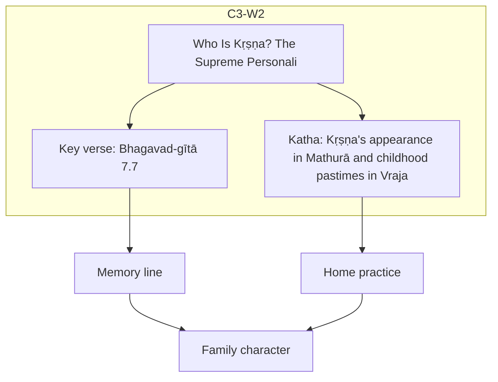

# C3-W2 — Concept Map

```mermaid
flowchart TB
    subgraph MODULE["C3-W2"]
        A["Who Is Kṛṣṇa? The Supreme Personali"]
        B["Key verse: Bhagavad-gītā 7.7"]
        C["Katha: Kṛṣṇa's appearance in Mathurā and childhood pastimes in Vraja"]
    end
    A --> B
    A --> C
    B --> D[Memory line]
    C --> E[Home practice]
    D --> F[Family character]
    E --> F
```
