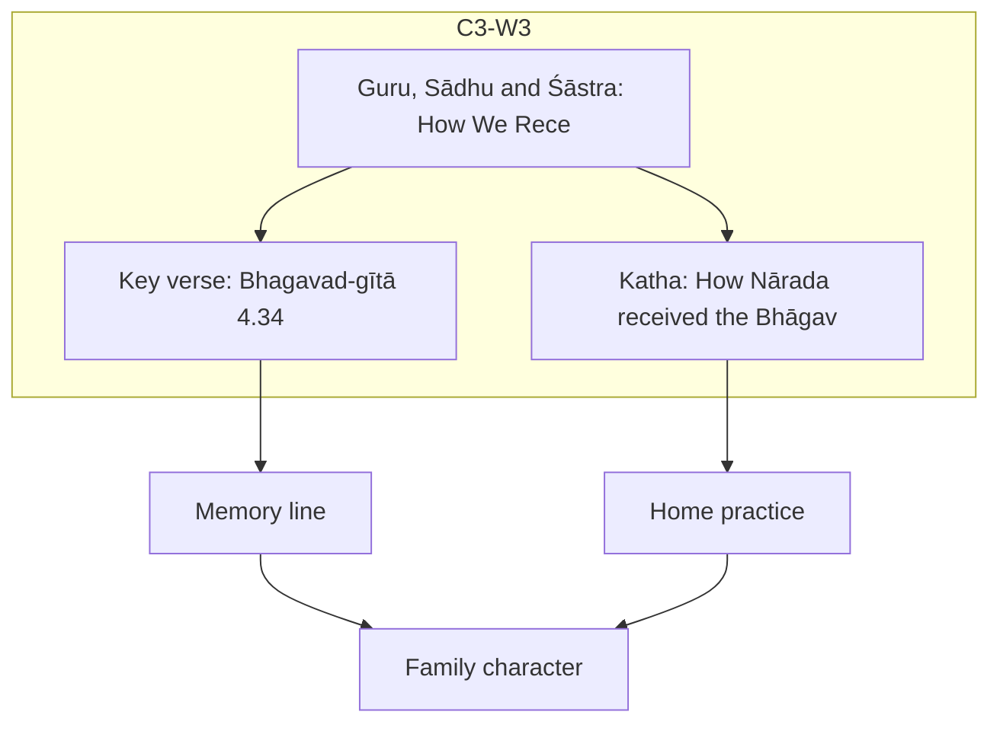

# C3-W3 — Concept Map

```mermaid
flowchart TB
    subgraph MODULE["C3-W3"]
        A["Guru, Sādhu and Śāstra: How We Rece"]
        B["Key verse: Bhagavad-gītā 4.34"]
        C["Katha: How Nārada received the Bhāgav"]
    end
    A --> B
    A --> C
    B --> D[Memory line]
    C --> E[Home practice]
    D --> F[Family character]
    E --> F
```
