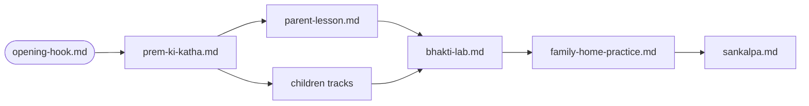

# C3-W3 — Process Flow

```mermaid
flowchart LR
    Hook([opening-hook.md]) --> Katha[prem-ki-katha.md]
    Katha --> Parent[parent-lesson.md]
    Katha --> Child[children tracks]
    Parent --> Lab[bhakti-lab.md]
    Child --> Lab
    Lab --> Home[family-home-practice.md]
    Home --> Sankalpa[sankalpa.md]
```
