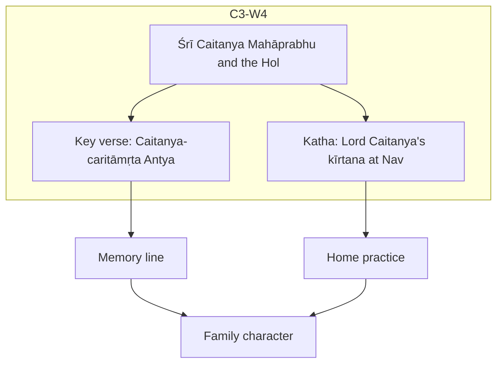

# C3-W4 — Concept Map

```mermaid
flowchart TB
    subgraph MODULE["C3-W4"]
        A["Śrī Caitanya Mahāprabhu and the Hol"]
        B["Key verse: Caitanya-caritāmṛta Antya"]
        C["Katha: Lord Caitanya's kīrtana at Nav"]
    end
    A --> B
    A --> C
    B --> D[Memory line]
    C --> E[Home practice]
    D --> F[Family character]
    E --> F
```
