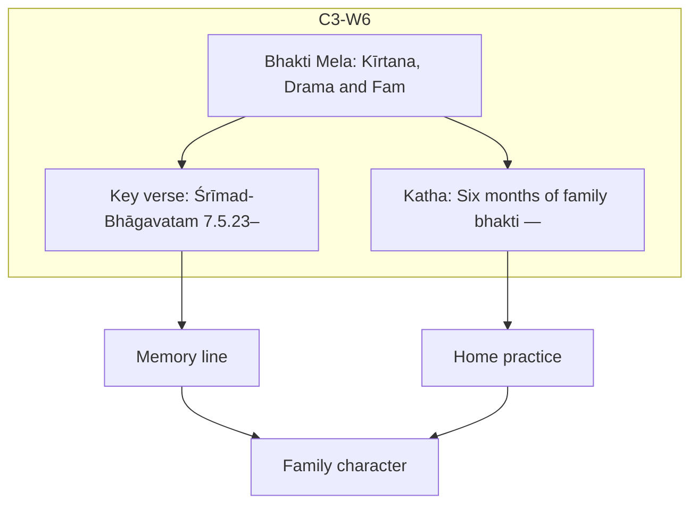

# C3-W6 — Concept Map

```mermaid
flowchart TB
    subgraph MODULE["C3-W6"]
        A["Bhakti Mela: Kīrtana, Drama and Fam"]
        B["Key verse: Śrīmad-Bhāgavatam 7.5.23–"]
        C["Katha: Six months of family bhakti — "]
    end
    A --> B
    A --> C
    B --> D[Memory line]
    C --> E[Home practice]
    D --> F[Family character]
    E --> F
```
