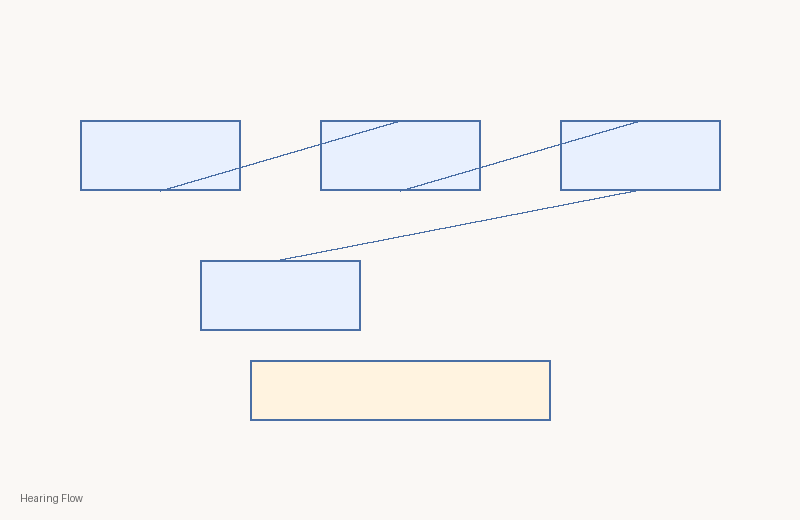
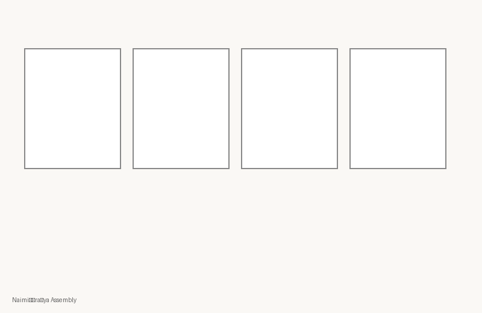
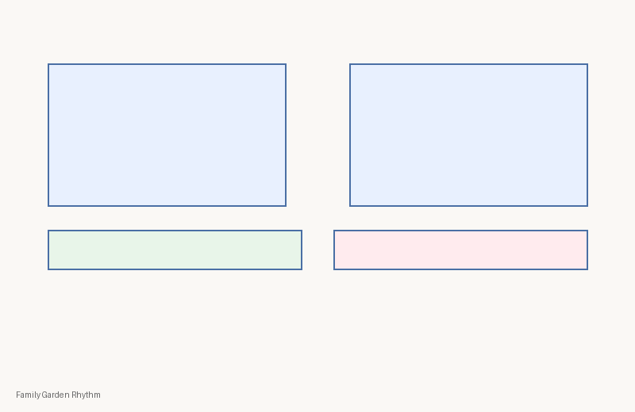
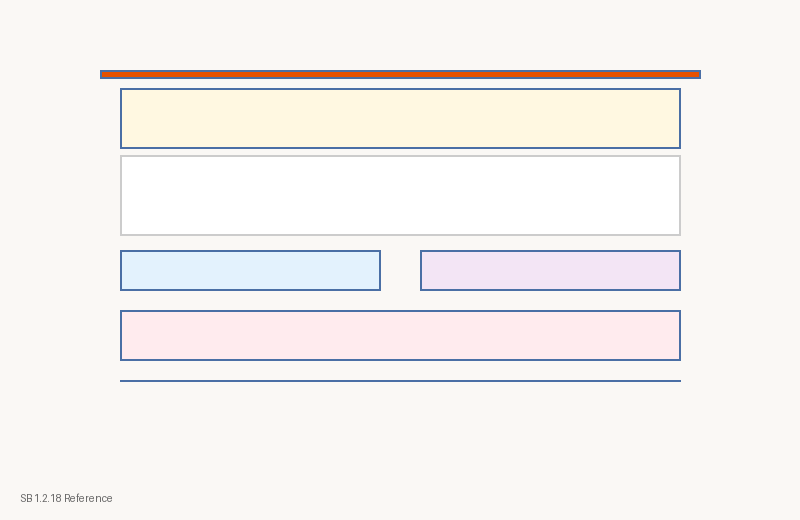
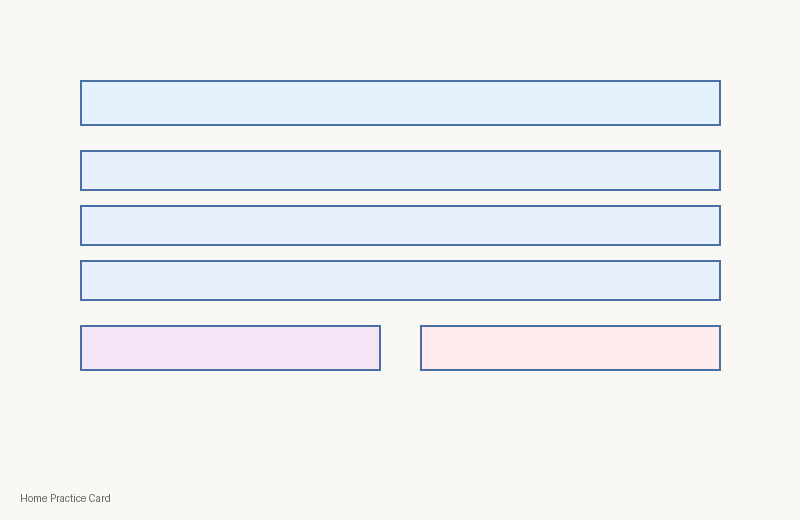
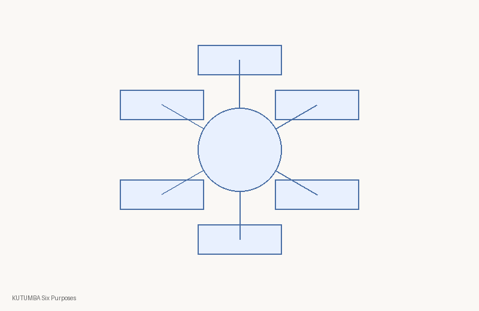

# C1-W1 Visual Contact Sheet
| Asset ID | Class | PNG | Source register | Rights | Review |
|---|---|---|---|---|---|
| `c1-w1-concept-hearing-flow` | concept-diagram |  | module register | kutumba-original | human-review-required |
| `c1-w1-storyboard-naimisharanya` | storyboard |  | module register | kutumba-original | human-review-required |
| `c1-w1-analogy-garden` | analogy-diagram |  | module register | kutumba-original | human-review-required |
| `c1-w1-verse-sb-1-2-18` | scripture-reference-card |  | module register | kutumba-original | human-review-required |
| `c1-w1-session-map` | process-flow |  | module register | kutumba-original | human-review-required |
| `c1-w1-home-practice` | family-practice-card |  | module register | kutumba-original | human-review-required |
| `c1-w1-charter-wheel` | comparison-chart |  | module register | kutumba-original | human-review-required |
