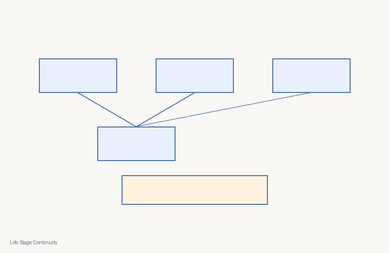
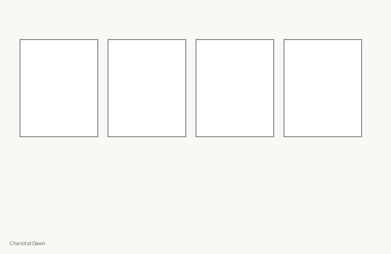
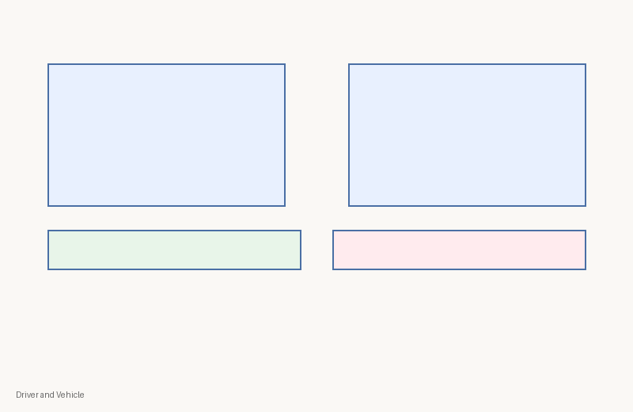
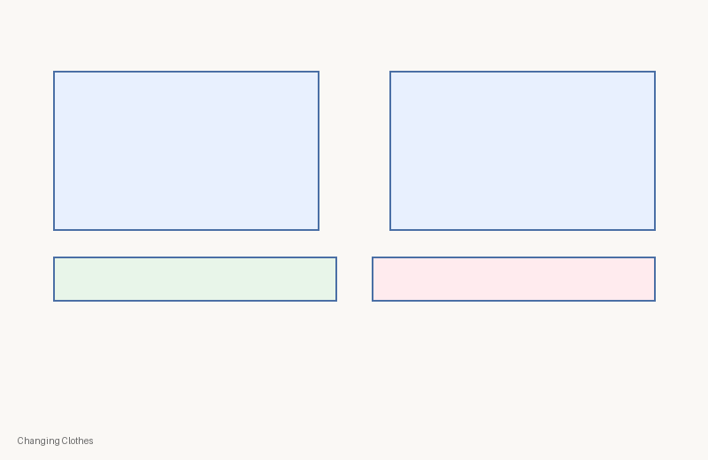
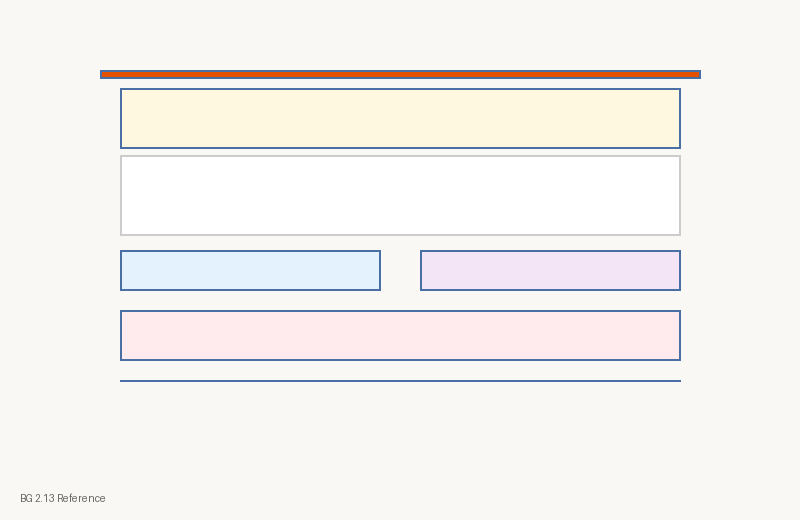
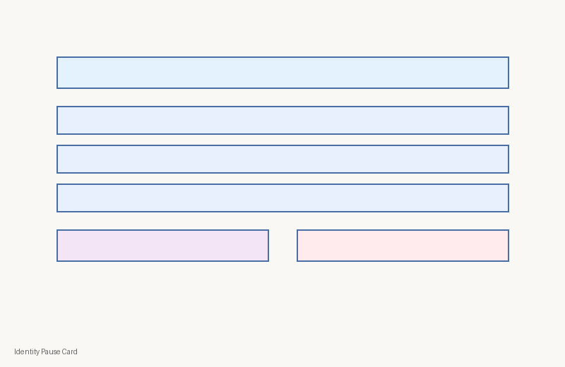

# C1-W2 Visual Contact Sheet
| Asset ID | Class | PNG | Source register | Rights | Review |
|---|---|---|---|---|---|
| `c1-w2-concept-life-stages` | concept-diagram |  | module register | kutumba-original | human-review-required |
| `c1-w2-storyboard-chariot` | storyboard |  | module register | kutumba-original | human-review-required |
| `c1-w2-analogy-driver-vehicle` | analogy-diagram |  | module register | kutumba-original | human-review-required |
| `c1-w2-analogy-changing-clothes` | analogy-diagram |  | module register | kutumba-original | human-review-required |
| `c1-w2-verse-bg-2-13` | scripture-reference-card |  | module register | kutumba-original | human-review-required |
| `c1-w2-session-map` | process-flow |  | module register | kutumba-original | human-review-required |
| `c1-w2-home-practice` | family-practice-card |  | module register | kutumba-original | human-review-required |
