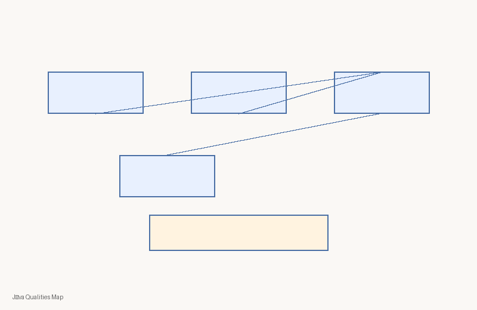
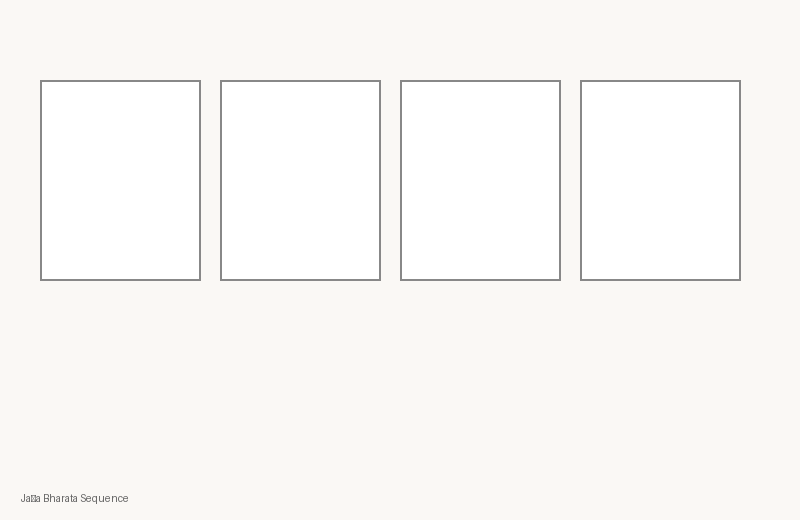
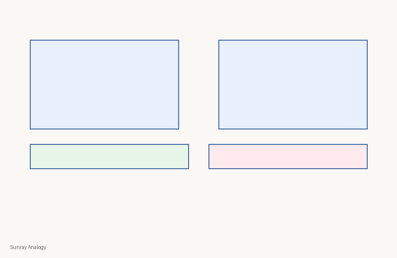
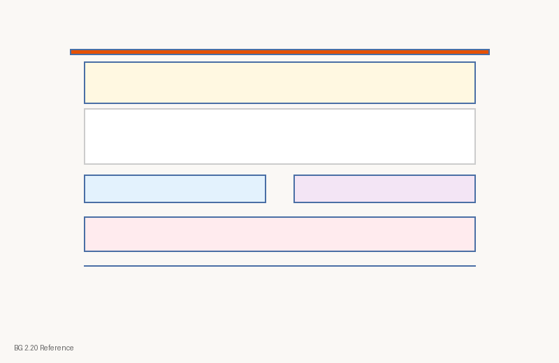
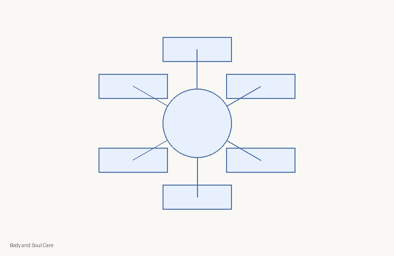

# C1-W3 Visual Contact Sheet
| Asset ID | Class | PNG | Source register | Rights | Review |
|---|---|---|---|---|---|
| `c1-w3-concept-jiva-qualities` | concept-diagram |  | module register | kutumba-original | human-review-required |
| `c1-w3-storyboard-jada-bharata` | storyboard |  | module register | kutumba-original | human-review-required |
| `c1-w3-analogy-sunray` | analogy-diagram |  | module register | kutumba-original | human-review-required |
| `c1-w3-verse-bg-2-20` | scripture-reference-card |  | module register | kutumba-original | human-review-required |
| `c1-w3-session-map` | process-flow |  | module register | kutumba-original | human-review-required |
| `c1-w3-home-practice` | family-practice-card |  | module register | kutumba-original | human-review-required |
| `c1-w3-body-soul-care` | comparison-chart |  | module register | kutumba-original | human-review-required |
