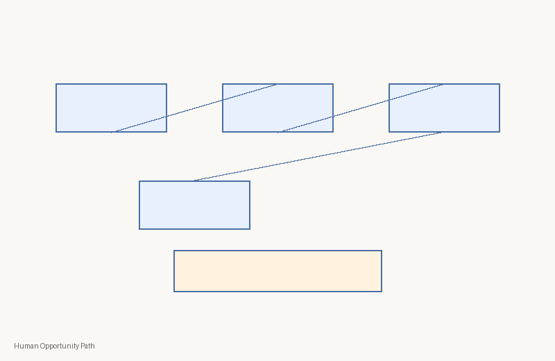
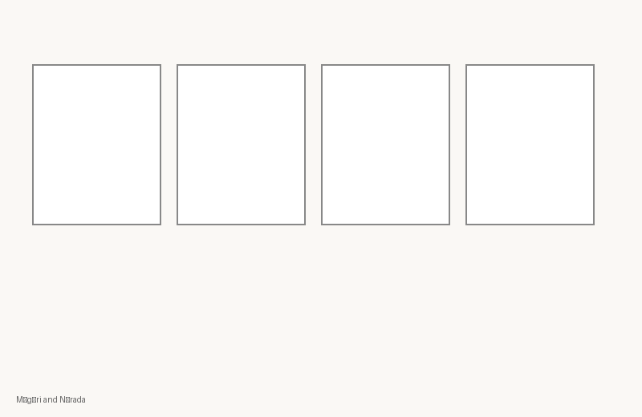
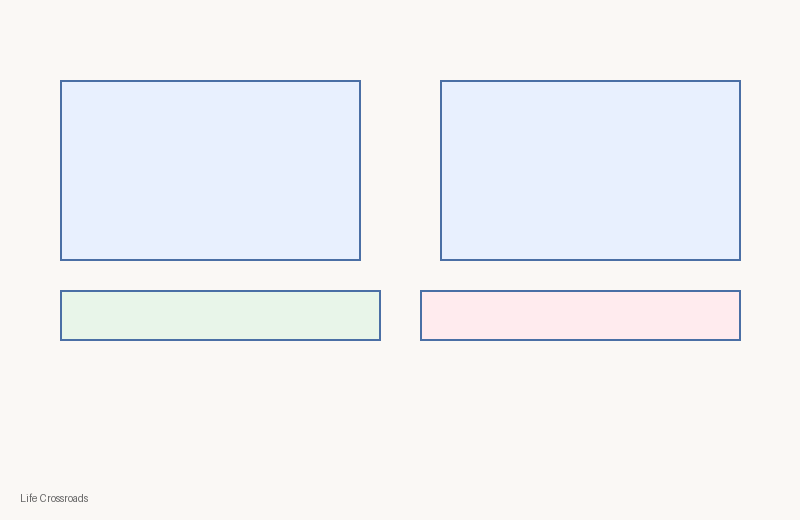
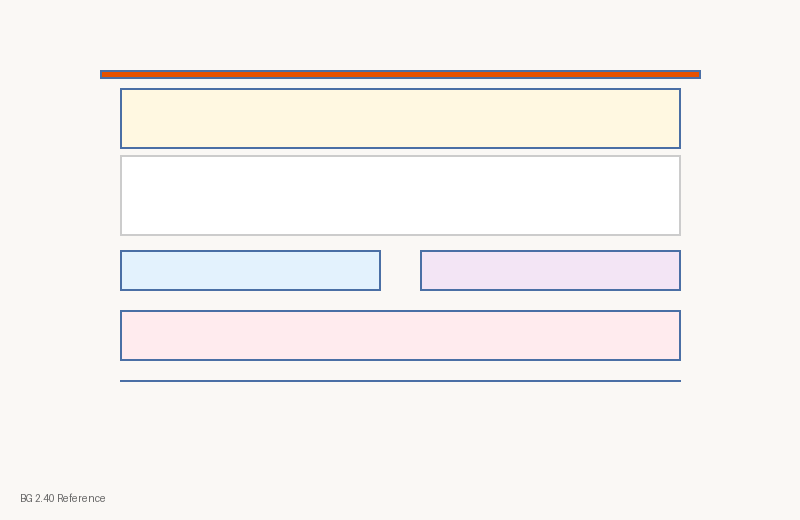
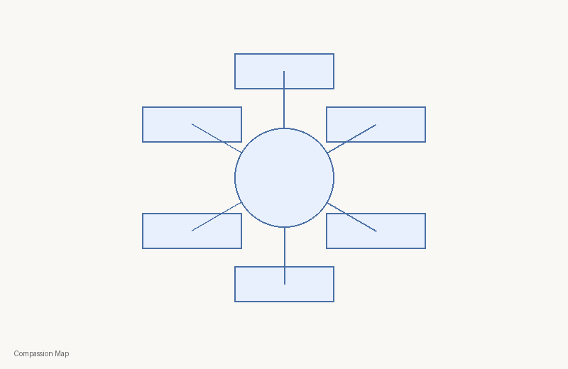

# C1-W4 Visual Contact Sheet
| Asset ID | Class | PNG | Source register | Rights | Review |
|---|---|---|---|---|---|
| `c1-w4-concept-opportunity-path` | concept-diagram |  | module register | kutumba-original | human-review-required |
| `c1-w4-storyboard-mrgari` | storyboard |  | module register | kutumba-original | human-review-required |
| `c1-w4-analogy-crossroads` | analogy-diagram |  | module register | kutumba-original | human-review-required |
| `c1-w4-verse-bg-2-40` | scripture-reference-card |  | module register | kutumba-original | human-review-required |
| `c1-w4-session-map` | process-flow |  | module register | kutumba-original | human-review-required |
| `c1-w4-home-practice` | family-practice-card |  | module register | kutumba-original | human-review-required |
| `c1-w4-compassion-map` | comparison-chart |  | module register | kutumba-original | human-review-required |
