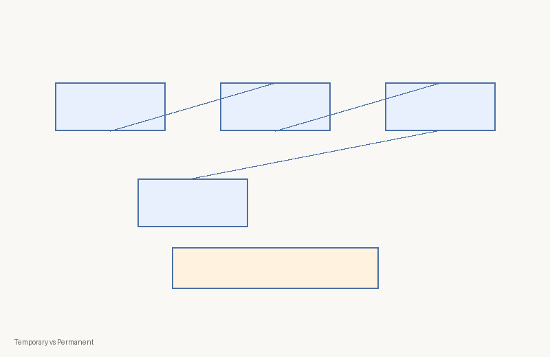
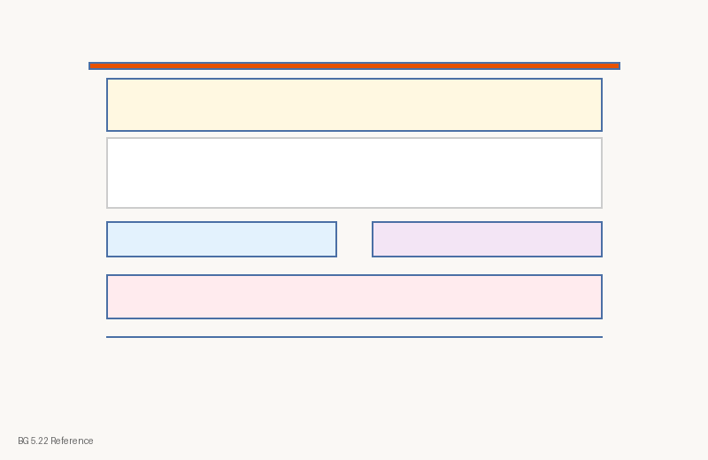
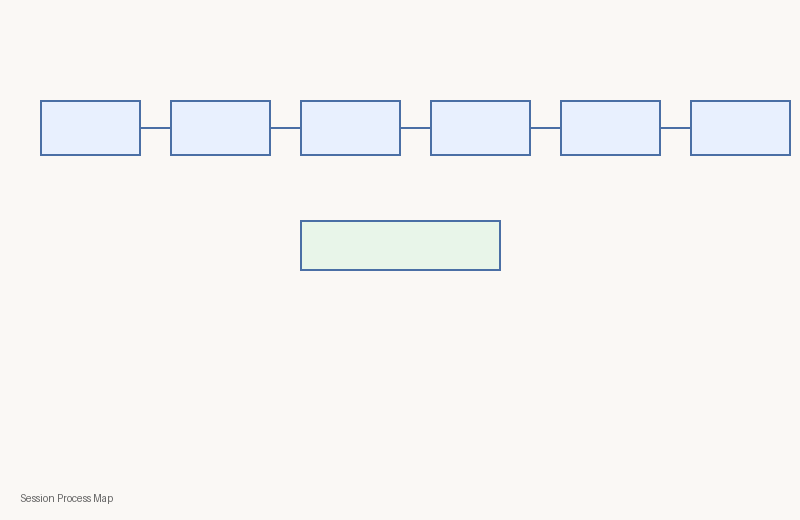
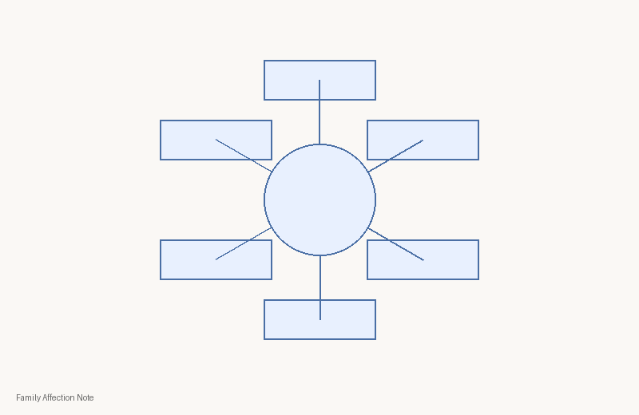

# C1-W5 Visual Contact Sheet
| Asset ID | Class | PNG | Source register | Rights | Review |
|---|---|---|---|---|---|
| `c1-w5-concept-temporary-permanent` | concept-diagram |  | module register | kutumba-original | human-review-required |
| `c1-w5-storyboard-dhruva` | storyboard |  | module register | kutumba-original | human-review-required |
| `c1-w5-analogy-pleasure-cycle` | analogy-diagram |  | module register | kutumba-original | human-review-required |
| `c1-w5-verse-bg-5-22` | scripture-reference-card |  | module register | kutumba-original | human-review-required |
| `c1-w5-session-map` | process-flow |  | module register | kutumba-original | human-review-required |
| `c1-w5-home-practice` | family-practice-card |  | module register | kutumba-original | human-review-required |
| `c1-w5-family-affection` | comparison-chart |  | module register | kutumba-original | human-review-required |
